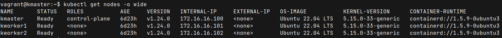

# kubernetes  3 Node Cluster Setup with Ansible

---

### Initial Vbox Networking Setup

Add the following line to `/etc/vbox/networks.conf`

```bash
* 10.0.0.0/8 192.168.0.0/16 172.16.0.0/16
```

### Provision the servers

```bash
vagrant up
```

### Dump the ssh config

```bash
vagrant ssh-config
```

copy the output to `~/.ssh/config` file. Test connectivity -

```bash
ssh kmaster
```

### Common configuration all servers

```bash
cd ansible

ansible-playbook -i hosts common.yaml
```

### Configure Control-Plane and generate join token script

```bash
ansible-playbook -i hosts control-plane.yaml
```

### Join the worker nodes to the CP

```bash
ansible-playbook -i hosts worker-node.yaml
```

### Test deployment

```bash
ssh kmaster
kubectl get nodes -o wide
```

I may take 5-10 minutes to get the following output


